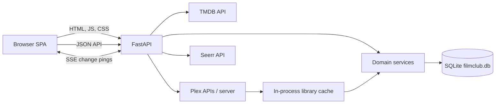
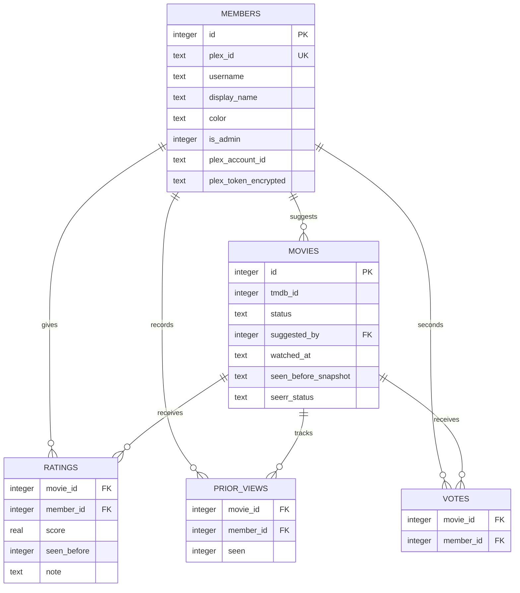
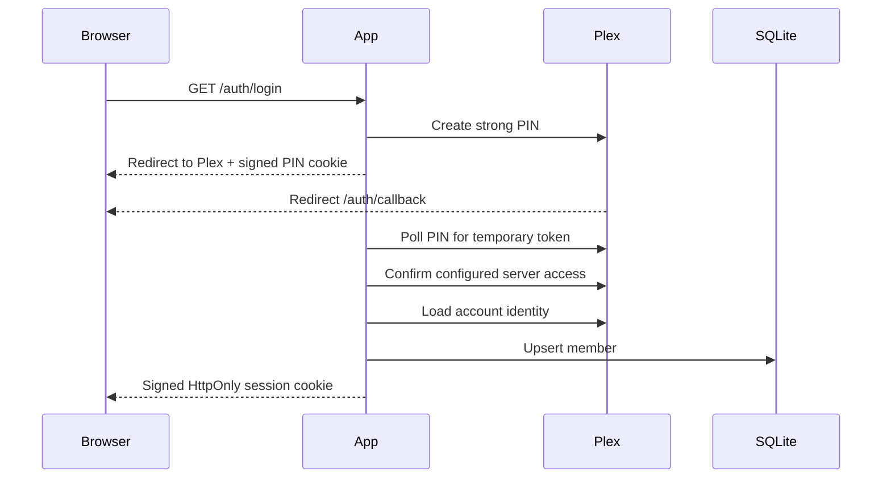

# Architecture

## System overview

Film Club Tracker is a single-process FastAPI application that serves both a JSON API and a build-free JavaScript SPA. SQLite is the durable store. TMDB supplies movie metadata, Plex provides authentication, library enrichment, and two-way rating synchronization, and Seerr can optionally request suggested films.

The application is designed for one small club and one Uvicorn worker. Its in-memory Plex cache and SSE subscriber registry are not shared across processes.

## Application layers

### Presentation layer

`static/index.html` is a minimal shell that loads versioned `static/styles.css` and `static/app.js`. The JavaScript client:

- stores the authenticated member and reminder counts in a small global `state` object;
- routes on URL hashes;
- renders screens with escaped template strings;
- calls APIs through one `api()` wrapper;
- keeps grid/list preference in `localStorage`;
- receives broad “something changed” notifications over `EventSource` and re-fetches the active view.

There is no component framework, client-side model layer, transpilation, or asset pipeline. Statistics charts are generated as inline SVG/HTML.

### HTTP/application layer

`app/main.py` creates the FastAPI application. It owns:

- request-body models and HTTP-level validation;
- Plex login/callback/logout routes;
- authentication dependencies on API routes;
- connection lifecycle around service calls;
- static file and health endpoint serving;
- conversion of integration errors into HTTP responses;
- `BroadcastMiddleware`, which emits an SSE notification after successful mutating `/api/` requests.

The startup handler initializes/migrates the database, warns about missing configuration, and starts the perpetual Plex refresh loop.

### Domain/service layer

`app/service.py` contains most product behavior and read-model assembly:

- eligibility and member coverage;
- backlog sorting/filtering and seconding;
- current selection and archive transitions;
- rating defaults and updates;
- member profiles and reminder counts;
- admin member listing, merging, and deletion.

`app/stats.py` is a separate calculation module. It loads database rows and returns fully computed structures for the Stats screen, including confidence flags and suppressed pairwise cells.

### Persistence layer

`app/db.py` exposes a small connection factory and thin query/mutation helpers. Each route generally opens one connection and closes it in `finally`. Rows use `sqlite3.Row`; API-facing shapes are produced by `member_public()` and `movie_base()`.

`app/schema.sql` initializes new databases and enables WAL and foreign keys. `app/migrations.py` then applies ordered, transactional migrations recorded in a `schema_migrations` table, writing a timestamped backup under `<data dir>/backups/` before any pending migration. Migration `1` is the baseline (the additive column set from the former `db._migrate()`), so both fresh and existing databases converge on the same recorded version.

**Rollback** is deliberately simple: stop the container, restore the pre-migration backup that matches the failed upgrade from `<data dir>/backups/` over `filmclub.db` (removing any stale `-wal`/`-shm` sidecars), and start the previous image or source tag. There are no down-migrations by design.

`/healthz` is an unauthenticated liveness check (the process can answer HTTP). `/readyz` is a readiness check that reports the app version, whether the database is reachable and migrated to the latest schema, and whether the signing secret is durable — returning 503 until the app can serve its purpose, and never returning secret values. `/api/admin/diagnostics` (admin only) surfaces the app/schema version, database integrity and row counts, backup status, and which integrations are enabled.

## Major modules and entry points

| Module | Responsibility |
|---|---|
| `app.main:app` | Uvicorn/FastAPI entry point and route boundary |
| `app.config` | Environment loading, data paths, client-ID persistence |
| `app.auth` | Session serialization, current-member resolution, admin enforcement |
| `app.service` | Core domain behavior and API read models |
| `app.stats` | Aggregate and statistical read model |
| `app.plex` | OAuth, server authorization, library cache, deep links |
| `app.plex_ratings` | Per-user rating writes and inbound webhook matching |
| `app.token_crypto` | Encryption boundary for stored Plex user tokens |
| `app.tmdb` | Search and full metadata retrieval |
| `app.seerr` | Optional request/deduplication integration |
| `app.events` | In-memory SSE subscription fan-out |
| `static/app.js` | SPA entry point, router, rendering, interactions |

Uvicorn runs `app.main:app`. `/` returns the SPA shell, `/static/*` serves assets, `/api/*` is the authenticated application API, and `/auth/*` performs login/logout.

## Persistence model

Important persistence semantics:

- Absence of a `prior_views` row means unknown.
- A movie is eligible when any `prior_views.seen` is false; it is ineligible only when every member has a true row.
- Ratings and votes are unique per movie/member pair.
- `ratings.seen_before` is independent of editable prior-view state.
- Scheduling snapshots known prior-view answers into `movies.seen_before_snapshot` and sets `watched_at` to the next Tuesday.
- Archiving retains the scheduled date and snapshot.
- Lifecycle reversals retain ratings, notes, dates, snapshots, prior views, votes, and metadata; only status changes immediately. Re-picking from the backlog then refreshes the discussion date and snapshot.
- Deleting a movie cascades to ratings, prior views, and votes. Deleting a member sets `movies.suggested_by` to null and cascades member-owned child rows.

## Main data flows

### Authentication

The Plex token is encrypted before it is stored in the member row so the app can write that member's future ratings to Plex. The session itself contains only the local member ID and Plex UUID. On each protected request, `current_member()` resolves the database member and requires a decryptable user token; legacy identity-only sessions are rejected so the normal Plex login can populate it. `members.plex_rating_sync_enabled` lets each member pause both outbound writes and inbound webhook application without deleting that connection. Token encryption derives from the durable data key (`config.DATA_KEY` — `SESSION_SECRET` if set, else the generated `master.key`), which is separate from the cookie-signing secret (`session.key`); rotating the data key requires members to sign in again, whereas rotating the signing secret only forces a re-login. `DEV_BYPASS_USER` short-circuits this flow and is development-only.

### Suggesting a film

1. The search modal calls `GET /api/tmdb/search?q=...`.
2. `tmdb.search()` returns capped results and performs parallel director lookups.
3. Selection posts a TMDB ID to `POST /api/movies`.
4. `tmdb.details()` fetches full metadata, including credits, original language, and external IDs.
5. The route rejects an existing TMDB ID, then `service.add_suggestion()` snapshots metadata into SQLite.
6. If Seerr is configured, the app checks the Plex cache, performs a targeted live Plex lookup on a miss, and otherwise calls Seerr.
7. Seerr outcome is stored as `movies.seerr_status`. Failure does not undo the inserted suggestion.
8. Middleware broadcasts a change ping to connected clients.

### Weekly lifecycle

```mermaid
stateDiagram-v2
    [*] --> suggested: add suggestion
    suggested --> scheduled: schedule; set next Tuesday; snapshot prior views
    scheduled --> watched: archive after discussion
    scheduled --> suggested: unschedule; retain movie history
    watched --> suggested: unwatch; retain movie history
    watched --> scheduled: admin correction; retain movie history
```

The code does not constrain scheduling to admins and does not enforce a single scheduled movie. Both are current behaviors, whether or not the UI normally produces those edge cases.

### Ratings and statistics

Ratings are accepted for `scheduled` and `watched` movies in half-star steps from 0.5 to 5.0. A member can update their unique rating. The default “seen before” value comes from the frozen snapshot, then live prior views, then false.

While a movie is `scheduled`, authenticated reads expose a rating only to the member who created it. Other members' scores and notes, group aggregates, public-profile activity, and statistics remain hidden. Moving the movie to `watched` reveals the complete rating set without changing the stored rows.

After a local save commits, `app.plex_ratings` resolves the movie's Plex rating key and sends the score multiplied by two with that member's decrypted token. The local write remains authoritative if Plex is unavailable or the movie is absent from the library.

Plex sends `media.rate` events to the secret webhook URL. The app validates the server UUID, maps the Plex account and TMDB/IMDb identity to local rows, divides the 1–10 score by two, and updates only scheduled/watched movies. An unchanged score is ignored to suppress the outbound/inbound echo. This is future-only synchronization; there is no historical reconciliation or rating-deletion sync.

`app/stats.py` computes the entire stats response server-side from watched-film ratings only. It uses these explicit floors:

- five rated films for per-member confidence;
- three raters for per-film confidence;
- five overlapping movies for pairwise correlations.

The client renders rather than recalculates these statistics.

## API boundaries

Authenticated read APIs expose the current member, reminders, members, member profiles, backlog, current selection, watched archive, movie details, TMDB search, and statistics. Authenticated mutation APIs update profiles, suggestions, scheduling state, dates, prior views, seconds, and ratings.

Admin-only APIs list enriched member records, merge members, grant/revoke database admin status, delete any movie, and force a Plex library refresh.

There is no separately versioned public API and no generated client. Pydantic validates request bodies, while response structures are ordinary dictionaries rather than declared response models.

## State management and live updates

Durable state is SQLite. Browser state is deliberately small and is reconstructed from APIs. The Plex library is a module-level cache containing matched IDs, deep links, and available Rotten Tomatoes critic/audience scores. SSE subscriber queues live in a module-level set.

`BroadcastMiddleware` observes successful POST/PUT/PATCH/DELETE requests below `/api/` and broadcasts the request path plus the caller's `X-Client-Id`. The secret-bearing Plex webhook route is excluded and emits a separate non-sensitive event only after an actual rating update. Other tabs debounce events, refresh reminder counts, and rerender unless the user is editing an input or has a modal open. Events contain no changed entity payload, so clients always re-fetch.

## Build and deployment

The Docker image uses `python:3.12-slim`, installs `requirements.txt`, copies `app/` and `static/`, exposes port 8000, and runs one Uvicorn process. `/data` is a declared volume and the image health check calls `/healthz`.

The public installation path is the portable `docker-compose.yml`: clone, build, start, and complete the browser setup wizard. The installation-specific `deploy-from-mac.sh` and `deploy.sh` remain maintainer automation, not an end-user prerequisite.

`docker-compose.yml` mounts `./data`; operators may replace it with an absolute persistent host path. The volume contains SQLite, migration backups, the generated Plex client ID, and the master encryption key.

On an unconfigured database the app logs a one-time setup code and stores only a salted SHA-256 hash of it in `/data/setup_code` (the code expires after 30 minutes and wrong guesses are rate-limited to a rolling window; restart to reissue). The wizard validates required Plex/TMDB credentials, stores sensitive values encrypted in `app_settings`, and marks setup complete. The first authorized Plex login atomically claims the durable owner role. Admin settings reuse the same validation/storage layer. Explicit environment values take precedence and are shown read-only.

## Visible architectural decisions

- A monolith and direct SQLite access favor operability for a six-person self-hosted group.
- Metadata snapshotting removes external-service dependencies from normal reads.
- Separate mutable prior views and frozen rating history preserve eligibility and historical meaning.
- Optional integrations degrade instead of blocking the core suggestion flow.
- Build-free frontend assets minimize deployment complexity.
- Server-side statistics centralize small-sample rules.
- In-process SSE and caches intentionally trade horizontal scalability for simplicity.

See `docs/DECISIONS.md` for evidence and confidence levels.

## Limitations and risks

- Focused rating-sync tests exist; broader domain coverage, linting, formatting enforcement, and CI do not.
- Inline migrations have no schema version, audit record, rollback, or general migration runner.
- `watched_at` represents two related concepts: scheduled discussion date and archive date.
- The app can hold multiple scheduled movies.
- Most weekly lifecycle actions require authentication but not admin permission.
- Member merge drops source votes rather than transferring them.
- SSE and Plex cache behavior becomes inconsistent with multiple workers or replicas.
- A slow or offline TMDB prevents search and new suggestions.
- `/healthz` does not verify the database or external integrations.
- Startup background tasks are not explicitly cancelled at shutdown.
- Environment validation warns instead of failing, which permits partially configured production starts.
- Sensitive values exist in local/generated repository artifacts and need separate remediation.
- The one-time importer remains in source after its completed use.
